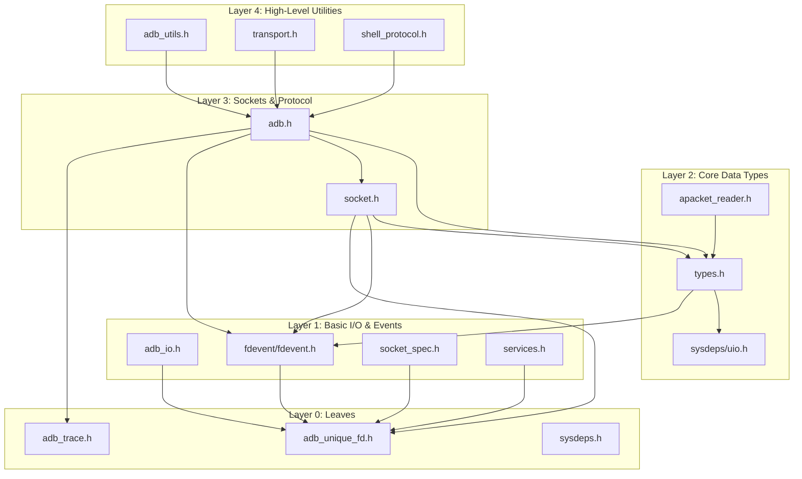

# ADB Rust Porting Plan

This document outlines the step-by-step plan for porting the ADB C++ source files to Rust. The order is determined by a bottom-up analysis of the dependency graph to ensure each step is independent or depends only on already-ported components.

## Dependency Graph Overview

The C++ codebase is structured in layers, from low-level utilities to high-level transport and service management.

## Porting Steps

Each step involves porting 1-2 files and implementing a corresponding testing strategy.

### Step 1: Trace and FD Management
- **Files**: `adb_trace.h`, `adb_unique_fd.h`
- **Description**: Port the logging/tracing macros and the `unique_fd` wrapper.
- **Testing**: 
    - Unit tests in Rust to verify `unique_fd` correctly closes on drop.
    - Verify trace levels are correctly parsed from environment variables.
- **Notes**:
    - For tracing, prefer to integrate with the `tracing` crate.
    - For FD management, prefer to use the rust stdlib. Move semantics and RAII are already tightly baked in to Rust.
    - If it makes sense for callers to use the `tracing` and stdlib APIs directly, simply write some documentation explaining how to do the translation.

### Step 2: System Dependencies and Basic I/O
- **Files**: `sysdeps.h`, `adb_io.h`
- **Description**: Port platform-specific abstractions (wrappers for `read`, `write`, `close`) and the `ReadFdExactly`/`WriteFdExactly` utilities.
- **Testing**:
    - Port `adb_io_test.cpp` to Rust.
    - Integration test: Read/write to a pipe and verify exact byte counts.
- **Notes**:
    - First try to look for equivalent functionality in the standard library. A lot of the standard library functions in Rust are already platform-agnostic.
    - If it makes sense for callers to use the standard library APIs directly, simply write some documentation explaining how to do the translation.

### Step 3: Event Loop Abstraction
- **Files**: `fdevent/fdevent.h`
- **Description**: Port the `fdevent` context and event handling logic. This is critical for the asynchronous nature of ADB.
- **Testing**:
    - Port `fdevent_test.cpp`.
    - Mock FD testing to ensure events (READ/WRITE) trigger correct callbacks.
- **Notes**:
    - First try to see if using the `tokio` async runtime is a good fit.
    - If it makes sense for callers to use the `tokio` async runtime APIs directly, simply write some documentation explaining how to do the translation.
    - If the translation from C to Rust is not one-to-one, consider creating helper types and functions to aid the transition.

### Step 4: Core Data Structures
- **Files**: `types.h`
- **Description**: Port `Block`, `amessage`, `apacket`, and `IOVector`. These form the backbone of packet handling.
- **Testing**:
    - Port `types_test.cpp`.
    - Fuzzing `IOVector` operations (append, drop, coalesce).

### Step 5: Socket Specifications
- **Files**: `socket_spec.h`
- **Description**: Port parsing logic for socket specifications (e.g., `tcp:5555`, `localabstract:adb`).
- **Testing**:
    - Port `socket_spec_test.cpp`.
    - Unit tests with a wide range of valid and invalid spec strings.

### Step 6: Sockets Management
- **Files**: `socket.h`, `sockets.cpp`
- **Description**: Port the `asocket` structure and management logic.
- **Testing**:
    - Port `socket_test.cpp`.
    - Integration test with `mock_server.rs` to verify socket creation and data flow.

### Step 7: ADB Protocol Constants and Packet Reading
- **Files**: `adb.h`, `apacket_reader.h`
- **Description**: Port protocol constants, versions, and the `apacket_reader` utility.
- **Testing**:
    - Verify checksum calculations against the C++ implementation.
    - Unit tests for `apacket_reader` with fragmented packet data.

### Step 8: Utilities and Authentication
- **Files**: `adb_utils.h`, `adb_auth.h`
- **Description**: Port general utilities (path handling, hex dumping) and the authentication interfaces.
- **Testing**:
    - Port `adb_utils_test.cpp`.
    - Integration with already ported Rust `crypto` library.

### Step 9: Transport Layer
- **Files**: `transport.h`, `transport.cpp`
- **Description**: Port the `atransport` class and transport selection logic.
- **Testing**:
    - Port `transport_test.cpp`.
    - Mock transport testing to verify state transitions (online, offline, authorizing).

### Step 10: ADB Services
- **Files**: `services.h`, `services.cpp`
- **Description**: Port the high-level service handling (e.g., `shell`, `push`, `pull`).
- **Testing**:
    - Full integration tests using `test/tests/integration_test.rs`.
    - Compare service responses between Rust and C++ implementations.
