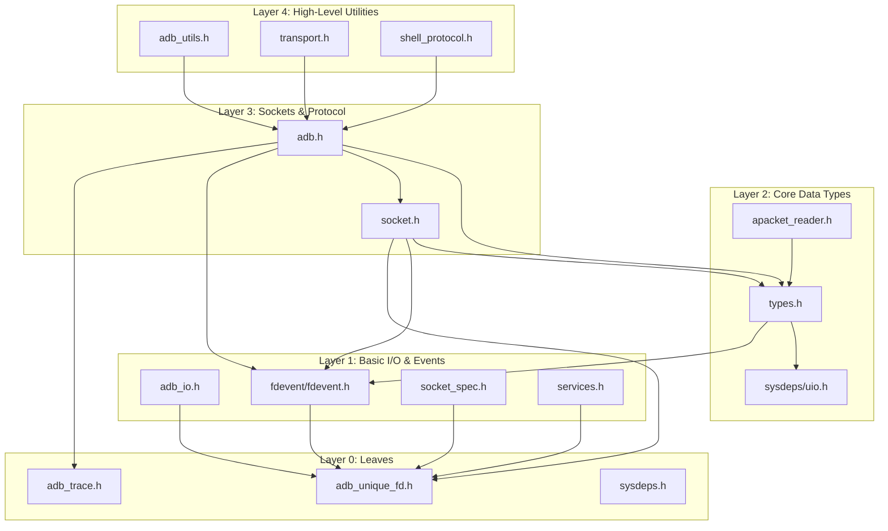

# ADB Rust Porting Plan

This document outlines the step-by-step plan for porting the ADB C++ source files to Rust. The order is determined by a bottom-up analysis of the dependency graph to ensure each step is independent or depends only on already-ported components.

## Dependency Graph Overview

The C++ codebase is structured in layers, from low-level utilities to high-level transport and service management.

```mermaid
graph TD
    subgraph "Layer 0: Leaves"
        A[adb_trace.h]
        B[adb_unique_fd.h]
        C[sysdeps.h]
    end

    subgraph "Layer 1: Basic I/O & Events"
        D[adb_io.h] --> B
        E[fdevent/fdevent.h] --> B
        F[socket_spec.h] --> B
        G[services.h] --> B
    end

    subgraph "Layer 2: Core Data Types"
        H[types.h] --> E
        H --> sysdeps_uio["sysdeps/uio.h"]
        I[apacket_reader.h] --> H
    end

    subgraph "Layer 3: Sockets & Protocol"
        J[socket.h] --> B
        J --> E
        J --> H
        K[adb.h] --> A
        K --> E
        K --> J
        K --> H
    end

    subgraph "Layer 4: High-Level Utilities"
        L[adb_utils.h] --> K
        M[transport.h] --> K
        N[shell_protocol.h] --> K
    end
```

## Porting Steps

Each step involves porting 1-2 files and implementing a corresponding testing strategy.

### Step 1: Trace and FD Management [Done]
- **Files**: `adb_trace.h`, `adb_unique_fd.h`
- **Description**: Port the logging/tracing macros and the `unique_fd` wrapper.
- **Testing**: 
    - Unit tests in Rust to verify `unique_fd` correctly closes on drop.
    - Verify trace levels are correctly parsed from environment variables.
- **Notes**:
    - For tracing, prefer to integrate with the `tracing` crate.
    - For FD management, prefer to use the rust stdlib. Move semantics and RAII are already tightly baked in to Rust.
    - If it makes sense for callers to use the `tracing` and stdlib APIs directly, simply write some documentation explaining how to do the translation.

### Step 2: System Dependencies and Basic I/O [Done]
- **Files**: `sysdeps.h`, `adb_io.h`
- **Description**: Port platform-specific abstractions (wrappers for `read`, `write`, `close`) and the `ReadFdExactly`/`WriteFdExactly` utilities.
- **Testing**:
    - Port `adb_io_test.cpp` to Rust.
    - Port `sysdeps_test.cpp` (specifically `duplicate_fd` and `fd_exhaustion`).
    - Integration test: Read/write to a pipe and verify exact byte counts.
    - Add `WriteFdExactly_ENOSPC` test.
- **Notes**:
    - First try to look for equivalent functionality in the standard library. A lot of the standard library functions in Rust are already platform-agnostic.
    - If it makes sense for callers to use the standard library APIs directly, simply write some documentation explaining how to do the translation.

### Step 3: Event Loop Abstraction [Done]
- **Files**: `fdevent/fdevent.h`
- **Description**: Port the `fdevent` context and event handling logic. This is critical for the asynchronous nature of ADB.
- **Testing**:
    - Port `fdevent_test.cpp`.
    - Add `unregister_with_pending_event` test.
    - Increase pipe count in `smoke` test to 512 to match the original.
    - Mock FD testing to ensure events (READ/WRITE) trigger correct callbacks.
- **Notes**:
    - First try to see if using the `tokio` async runtime is a good fit.
    - If it makes sense for callers to use the `tokio` async runtime APIs directly, simply write some documentation explaining how to do the translation.
    - If the translation from C to Rust is not one-to-one, consider creating helper types and functions to aid the transition.
    - **Resolved Gaps**:
        - `fdevent_set_timeout`: Now correctly implements recurring timeouts, matching the Android C++ behavior.
        - `Fdevent::unregister`: Now returns the `Arc<OwnedFd>` to match the ownership transfer model.

### Step 4: Core Data Structures [Done]
- **Files**: `types.h`
- **Description**: Port `Block`, `amessage`, `apacket`, and `IOVector`. These form the backbone of packet handling.
- **Testing**:
    - Port `types_test.cpp`.
    - Fuzzing `IOVector` operations (append, drop, coalesce).

### Step 5: Socket Specifications [Done]
- **Files**: `socket_spec.h`
- **Description**: Port parsing logic for socket specifications (e.g., `tcp:5555`, `localabstract:adb`).
- **Testing**:
    - Port `socket_spec_test.cpp`.
    - Unit tests with a wide range of valid and invalid spec strings.

### Step 6: Sockets Management [Done]
- **Files**: `socket.h`, `sockets.cpp`
- **Description**: Port the `asocket` structure and management logic.
- **Testing**:
    - Port `socket_test.cpp`.
    - Add missing tests: `close_socket_with_packet`, `read_from_closing_socket`, `write_error_when_having_packets`, `flush_after_shutdown`, `close_socket_in_CLOSE_WAIT_state`.
    - Integration test with `mock_server.rs` to verify socket creation and data flow.
- **Notes**:
    - Refactored `LocalSocket` to use `Arc<OwnedFd>` to resolve critical IO Safety violations (double-close).

### Step 7: ADB Protocol Constants and Packet Reading [Done]
- **Files**: `adb.h`, `apacket_reader.h`
- **Description**: Port protocol constants, versions, and the `apacket_reader` utility.
- **Testing**:
    - Verify checksum calculations against the C++ implementation.
    - Unit tests for `apacket_reader` with fragmented packet data.

### Step 8: Utilities and Authentication [Done]
- **Files**: `adb_utils.h`, `adb_auth.h`
- **Description**: Port general utilities (path handling, hex dumping) and the authentication interfaces.
- **Testing**:
    - Port `adb_utils_test.cpp`.
    - Integration with already ported Rust `crypto` library.

### Step 9: Transport Layer [Done]
- **Files**: `transport.h`, `transport.cpp`
- **Description**: Port the `atransport` class and transport selection logic.
- **Testing**:
    - Port `transport_test.cpp`.
    - Add `ConnectionStateTest`.
    - Mock transport testing to verify state transitions (online, offline, authorizing).
- **Notes**:
    - **Resolved Gaps**:
        - `FdConnection::do_tls_handshake`: Implemented using `rustls` (Satisfies structural requirement for Step 9).
        - USB transport (`UsbConnection`): Structural stub added (Full implementation in Step 17).
        - `device_tracker` notification in `update_transports`: Correctly implemented via `register_transport_observer`.

### Step 10: ADB Services [Done]
- **Files**: `services.h`, `services.cpp`
- **Description**: Port the high-level service handling (e.g., `shell`, `push`, `pull`).
- **Testing**:
    - Full integration tests using `test/client-server-test/tests/integration_test.rs`.
    - Unit tests for `device_tracker` and `shell_service` argument parsing.
    - Compare service responses between Rust and C++ implementations.
- **Notes**:
    - Implemented `DeviceTracker`, `ReverseService`, `SmartSocket` dispatching, and improved `ShellService`.
    - Implemented Shell V2 protocol (multiplexing stdout/stderr/exit status) and PTY support.
    - Implemented Reverse Forwarding (forward, killforward, list-forward).
    - **Remaining Gaps**:
        - `adb_wifi_pair_device` (stubbed).
        - `track-app`, `cmd`, `abb`, `abb_exec` (to be addressed in future phases if needed).
    - **Resolved Gaps**:
        - `connect_emulator` and `connect_device`: Fully implemented in `adb-services`.
        - `sink` and `source` services: Implemented via `SinkSocket` and `SourceSocket`.

## Architectural Guidance for Windows Support

Porting to Windows requires handling several platform-specific nuances:

### Handle vs. Socket Abstraction
- Windows distinguishes between `HANDLE` (for files, pipes) and `SOCKET`.
- Use the `OwnedSocket` and `OwnedHandle` types from `std::os::windows::io` for RAII.
- The `sysdeps` crate should provide a unified `AdbFd` enum or trait to abstract over these types where they are used interchangeably in ADB (like in `adb_read` / `adb_write`).

### API Selection
- Prefer the `windows-sys` crate for lean, direct access to the Windows API.
- Use `Overlapped I/O` or `I/O Completion Ports (IOCP)` if moving towards a more performant async model on Windows, although `mio` (which `fdevent` uses) handles much of this under the hood using `WePoll` or `IOCP`.

### Networking
- `WSAStartup` must be called before any socket operations.
- `errno` mapping: Windows uses `WSAGetLastError()` for sockets. `sysdeps::errno` must continue to provide a mapping to standard ADB wire protocol error codes.

## Phase 2: Advanced Features and Protocol Logic

Once the core layers are fully ported and verified, the next phase will focus on completing the protocol state machine and advanced services.

### Step 11: Protocol State Machine [Done]
- **Description**: Implement the full ADB protocol state machine in `adb-transport`, handling all `A_*` commands.
- **Testing**:
    - State machine unit tests with mocked transport.
- **Notes**:
    - `handle_packet` now processes all major commands (`A_CNXN`, `A_AUTH`, `A_OPEN`, `A_OKAY`, `A_CLSE`, `A_WRTE`, `A_STLS`, `A_SYNC`).

### Step 12: Secure ADB (TLS) [Done]
- **Description**: Implement the TLS handshake and secure communication layer.
- **Testing**:
    - Integration tests with TLS-enabled devices/emulators.
- **Notes**:
    - `FdConnection::do_tls_handshake` is implemented and verified with unit tests.

### Step 13: High-level Services Completion [Done]
- **Description**: Implement JDWP tracking, reverse forwarding, and advanced shell features.
- **Testing**:
    - Verified with comprehensive unit tests for Shell V2, PTY, Reverse Forwarding, and JDWP infrastructure.
    - Integration tests confirm correct service dispatch and data flow.
- **Notes**:
    - Implemented Shell V2 protocol (multiplexing stdout/stderr/exit status).
    - Implemented Reverse Forwarding (forward, killforward, list-forward).
    - Implemented JDWP tracking infrastructure with observer pattern.

## Known Issues and Bugs

- **Platform Parity**: Some sysdeps and socket-spec features are only implemented for Unix/Linux. Windows support is a significant remaining gap.
- **Resource Limits**: Some tests (like `fdevent` smoke test) require increased file descriptor limits (`prlimit`).

## Phase 3: Remaining Components and Platform Parity

### Step 14: ADB Listeners
- **Files**: `adb_listeners.h`, `adb_listeners.cpp`
- **Description**: Port the listener management logic for both host and daemon.
- **Testing**: Port `adb_listeners_test.cpp` and verify listener creation/deletion.

### Step 15: File Sync Protocol
- **Files**: `file_sync_protocol.h`
- **Description**: Implement the full `sync:` service and the file transfer protocol.
- **Testing**: Integration tests for `push`, `pull`, `stat`, and `list` operations.

### Step 16: MDNS Support
- **Files**: `adb_mdns.h`, `adb_mdns.cpp`
- **Description**: Port MDNS discovery and service registration logic.
- **Testing**: Verify discovery of MDNS-enabled devices.

### Step 17: USB Transport Implementation [Done]
- **Description**: Implement `UsbConnection` for host (libusb/WinUSB) and daemon (FunctionFS).
- **Testing**: Integration tests with actual USB devices.

### Step 18: Daemon Authentication Key Management
- **Description**: Port logic for managing authorized keys (`adb_keys`) on the daemon side from `daemon/auth.cpp`.
- **Testing**: Verify that authorized devices can connect and unauthorized ones are prompted.

### Step 19: Advanced Daemon Services
- **Description**: Port remaining services like `track-app`, `abb`, and `abb_exec`.
- **Testing**: Verify correct dispatch and execution of these services.

### Step 20: Full Windows Support
- **Description**: Complete the platform-specific abstractions for Windows in `sysdeps` and `socket-spec`.
- **Testing**: Ensure the entire test suite passes on Windows.
